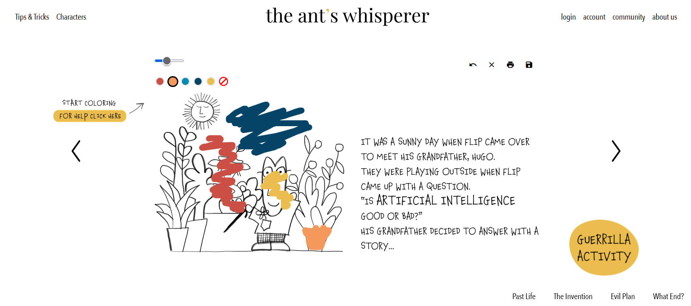
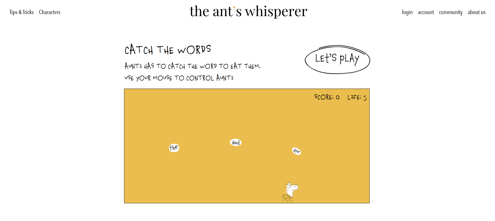
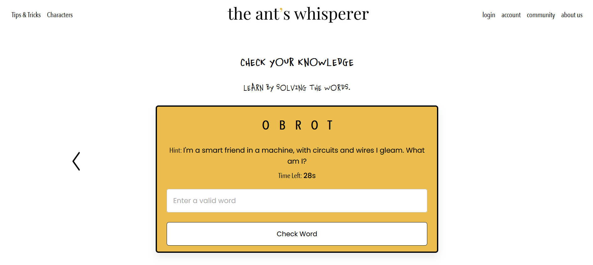

## Title

Upside Down

# Description

The website experience consists of an interactive narrative about a little boy who wonders about AI. This experience was designed especially for kids, ages 6 to 7 years old, with potential to extend the story to ages 8 to 10. The story revolves around Hugo, an old man who shares his childhood experience about AI with his grandson. For the user to go through the narrative, he/she must play little games, which were strategically inserted in the narrative.
Throughout the experience there are two other interactive features - for once the user can color the illustrations, and for another, the user can complete the guerrilla activities. These activities are suggestions of little rebellion acts to invite the user to reflect upon what was learned and share it with the world in a tangible format.

# Content

kids story with Ineractions of:
1. coloring images
2. catch words game
3. word scramble game

# run game

1. unzip the file
2. install the font in the folder /fonts
3. open the slide header.html
4. now you can experience the webside
5. any questions? contact us.

# implementation features

- html
- css
- Java Script
- Bootstrap

# plugin

- jl-coloringBook
- jquery (for catch game)

# Contact

our concept: https://miro.com/app/board/uXjVKRKtxfc=/
For any technical questions or feedback, please contact us at clara.o.correa@web.de

# group memebers

Sara P.: Design, Grafics
Clara Osterburg Correa: Coding, Implementation, Story
Anna B.: Dokumentation, story
Yousra M.: Video
